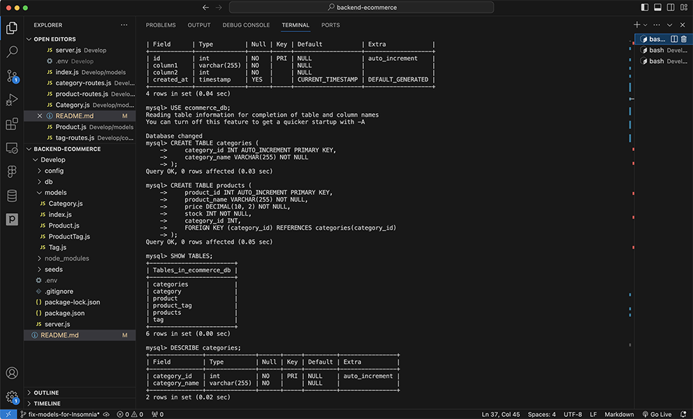

# Backend E-Commerce

## Description

This E-Commerce Backend project serves as the core of an e-commerce website, facilitating seamless interactions with a MySQL database via a RESTful API. Motivated by the need for internet retail companies to adopt the latest backend technologies, this project ensures competitive edge in the dynamic e-commerce market. It addresses the complexities of data management for product categories, individual products, and associated tags. The development process provided insights into RESTful API design, the Sequelize ORM, and the nuances of relational database management systems.

## Table of Contents

- [Installation](#installation)
- [Usage](#usage)
- [Demo](#demo)
- [Screenshot](#screenshot)
- [Credits](#credits)
- [License](#license)
- [Features](#features)
- [How to Contribute](#how-to-contribute)
- [Tests](#tests)

## Installation

To get this project up and running on your local machine, follow these steps:

1. Clone the repository using `git clone [https://github.com/charleshuurman/Back-end-E-commerce]`.
2. Navigate to the project's root directory in your terminal.
3. Run `npm install` to install the required dependencies.
4. Create a `.env` file to securely store your MySQL username, password, and database name.
5. Execute the `schema.sql` file within the MySQL shell to set up your database.
6. Seed the database with test data by running `npm run seed`.
7. Launch the server with `npm start`.

## Usage

Designed for backend operations of e-commerce sites, this application supports CRUD operations via API routes for categories, products, and tags.

Example API calls include:

- Fetch all products: `GET /api/products`
- Add a new category: `POST /api/categories`

## Demo

For a demonstration of the application's functionality, please refer to the following video:

## Screenshot

Below is a screenshot of the MySQL terminal using the E-Commerce Backend application:

## Credits

Starter code [Fantastic Umbrella](https://github.com/coding-boot-camp/fantastic-umbrella).
Developed by [Charles Huurman](https://github.com/charleshuurman).

Thanks to the Sequelize and MySQL2 npm package contributors.

## License

This project is released under the MIT License. See the [LICENSE](LICENSE.md) file for details.

## Features

- RESTful API endpoints for e-commerce operations.
- Secure MySQL database integration using environment variables.
- Comprehensive CRUD functionality for product management.

## How to Contribute

We welcome contributions! For significant changes, please open an issue first to discuss what you would like to change. Ensure that you update tests accordingly.

## Tests

Run `npm test` in the root directory to execute the test suite.
